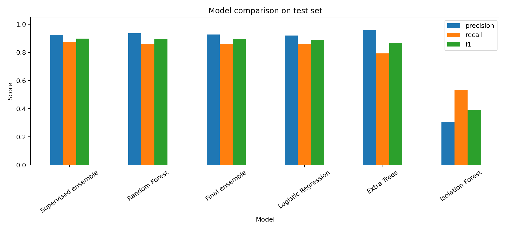
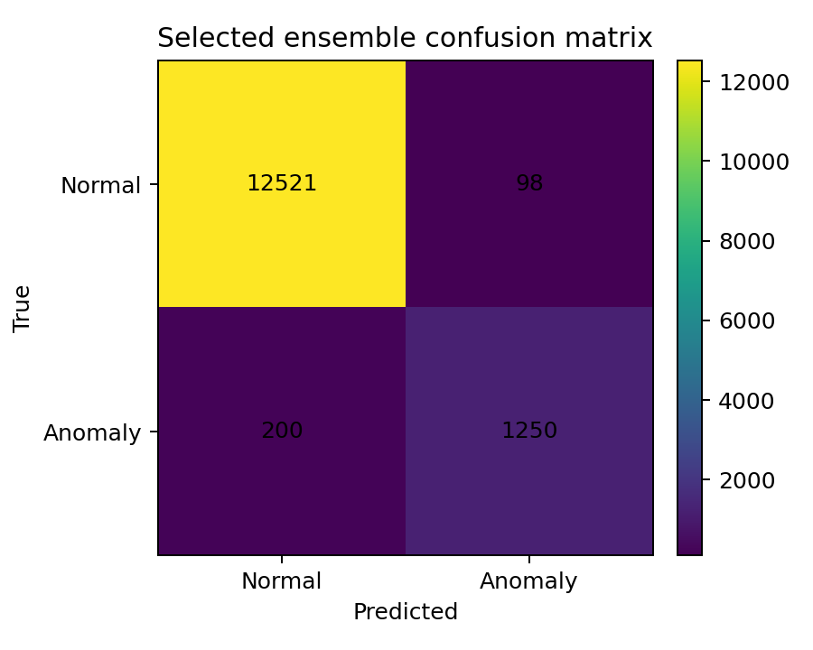
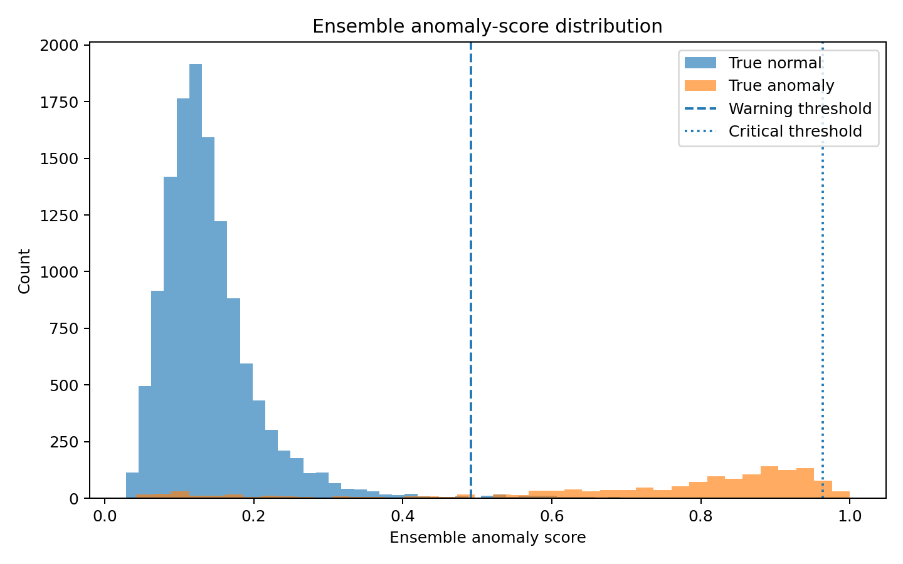
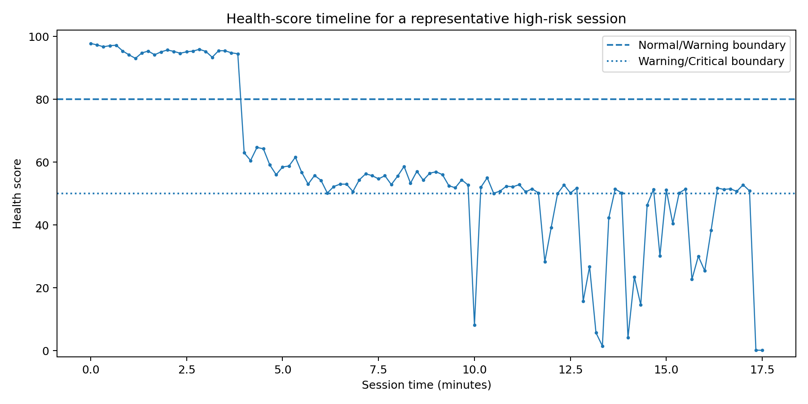
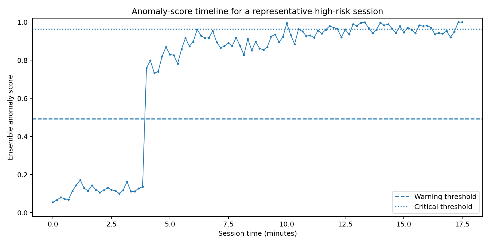
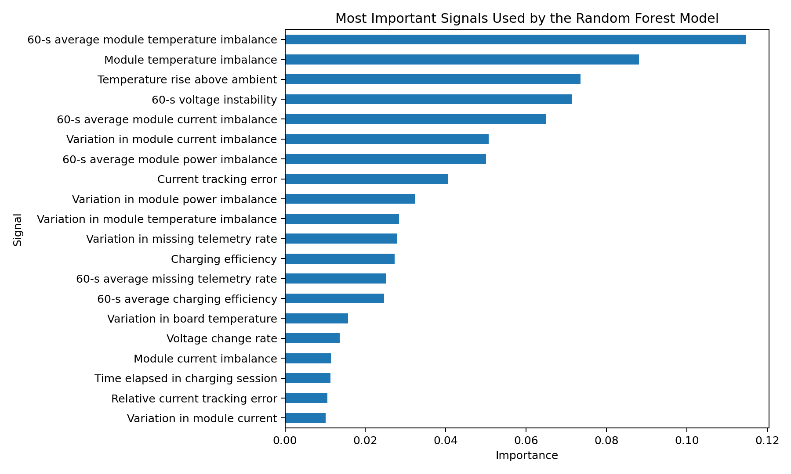
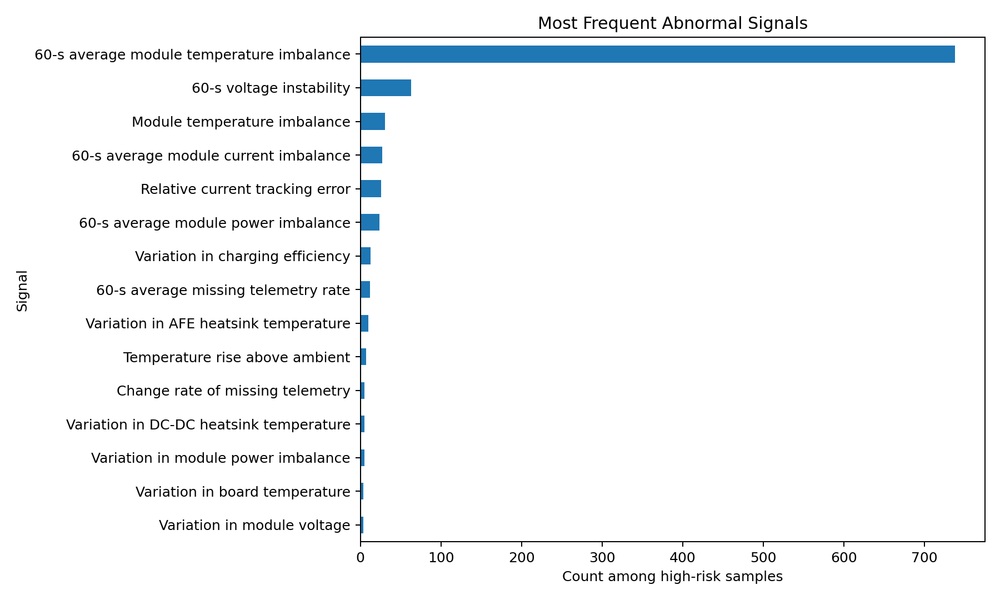

# EV Charger Anomaly Detection and Health Monitoring

This project implements a telemetry-based anomaly detection pipeline for EV charging infrastructure. It uses charger time-series data, rolling feature engineering, ensemble machine learning, calibrated alert thresholds, and feature-based explanations to detect abnormal operating states and convert them into maintenance-oriented health indicators.

The goal is not only to classify charger behavior as normal or abnormal, but also to provide a practical output for maintenance use: anomaly score, health score, alert status, and the main abnormal signals behind each warning.

## Main Features

* EV charger telemetry processing
* Rolling 60-second time-series features
* Session-safe train/validation/test split
* Supervised anomaly detection models
* Unsupervised Isolation Forest baseline
* Weighted ensemble anomaly score
* Balanced and conservative alert modes
* Calibrated health score from 0 to 100
* Feature-based anomaly explanation
* Result tables and plots for reporting

## Method

The pipeline follows this workflow:

```text
charger telemetry
    → cleaning and feature engineering
    → session-based data split
    → supervised models + unsupervised baseline
    → ensemble anomaly score
    → health score and alert status
    → abnormal feature ranking
```

The model uses electrical, thermal, charging-session, and module-level features such as voltage, current, power, temperature, current-demand mismatch, voltage instability, power-module imbalance, and module temperature gap.

Direct label or status fields are excluded from the model features to reduce leakage. The model is expected to learn from physical and operational telemetry patterns rather than simply copying existing status flags.

Raw telemetry-derived feature names are kept in the code and output tables for traceability. In figures and report-style outputs, they are converted into readable engineering labels.

## Models

The pipeline compares:

* Logistic Regression
* Random Forest
* Extra Trees
* Isolation Forest
* Supervised weighted ensemble
* Final ensemble model

The final ensemble combines supervised model probabilities with the unsupervised anomaly signal.

## Alert Modes

Two alert modes are available:

| Mode | Purpose |
|---|---|
| Balanced | Better trade-off between precision and recall |
| Conservative | Lower false-alarm rate for maintenance use |

The health score is calibrated from the ensemble anomaly score using the selected warning and critical thresholds. Scores below the warning threshold are mapped to the Normal range, scores between warning and critical thresholds are mapped to the Warning range, and scores above the critical threshold are mapped to the Critical range.

Alert status is assigned as:

```text
Normal   → health score above 80
Warning  → health score between 50 and 80
Critical → health score below 50
```

## Results

The current-anomaly detection experiment achieved strong test-set performance:

| Metric | Result |
|---|---:|
| Precision | ~0.93 |
| Recall | ~0.86 |
| F1-score | ~0.89 |
| False alarm rate | <1% |

The selected ensemble model detected most abnormal charger states while keeping false alarms low. The most important abnormal indicators were mainly related to:

* module temperature imbalance
* temperature deviation from ambient conditions
* voltage instability
* current mismatch
* module-level power imbalance

The abnormal-feature count plot shows that 60-second average module temperature imbalance was the most frequent top-ranked abnormal signal among high-risk samples. This does not mean it is the only important signal; the feature-importance plot shows that temperature, voltage, current, and module power imbalance all contributed to the model decision.

## Example Output

```text
Representative high-risk session
Health score: 4%
Status: Critical
Anomaly score: 0.96

Top abnormal signals:
1. 60-s average module temperature imbalance
2. 60-s voltage instability
3. 60-s average module current imbalance

Interpretation:
Sustained module temperature imbalance and voltage instability were detected.

Recommended action:
Inspect module thermal behavior, cooling condition, and module load sharing before the next high-power charging session.
```

## Figures

### Model Comparison



### Confusion Matrix



### Anomaly-Score Distribution



### Health-Score Timeline



### Anomaly-Score Timeline



### Feature Importance



### Top Abnormal Features



## Installation

Install the required Python packages:

```bash
pip install pandas numpy scikit-learn matplotlib joblib
```

## Usage

The repository includes a small sample telemetry file for demonstration. The full operational dataset should be stored locally under `private_data/` and is excluded from version control.

Run current anomaly detection with the sample file:

```bash
cd analysis

python run_pipeline.py --data ../sample_data/telemetry_sample_500.csv --target label_current_anomaly --output-dir ../results_current_anomaly --fast --alert-mode both --conservative-fpr 0.01
```

For a private full dataset, place the file under `private_data/` and pass its path to `--data`. The dataset itself should not be committed to GitHub.

## Main Outputs

The pipeline creates:

```text
results_current_anomaly/
├── tables/
│   ├── model_comparison.csv
│   ├── threshold_modes.csv
│   ├── anomaly_predictions_test.csv
│   ├── anomaly_reason_ranking.csv
│   └── feature_importance_random_forest.csv
│
├── figures/
│   ├── model_comparison_precision_recall_f1.png
│   ├── confusion_matrix_selected_ensemble.png
│   ├── ensemble_score_distribution.png
│   ├── health_score_timeline_representative_session.png
│   ├── anomaly_score_timeline_representative_session.png
│   ├── feature_importance_random_forest.png
│   └── top_abnormal_feature_counts.png
│
└── run_summary.md
```

## Current Limitations

The current version focuses mainly on current anomaly detection. Early-warning prediction for 5-, 10-, and 15-minute horizons is included as an extension, but it requires further calibration to reduce false alarms.

The explanation method is based on feature deviation from normal behavior. Future versions can add SHAP values and partial dependence plots for deeper interpretation.

## Future Work

Planned improvements include:

* early-warning prediction with lower false-alarm rates
* temporal cross-validation
* rule-based baseline comparison
* SHAP-based explanations
* partial dependence analysis for top features
* real-time dashboard deployment
* maintenance-log validation
* transfer testing across stations and charger types

## License

This project is released under the MIT License.

The repository includes only a small sample telemetry file for demonstration. The full operational dataset is private and excluded from version control.